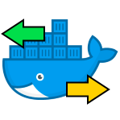

# docker-portmap-server



[](https://github.com/dmotte/docker-portmap-server/actions)
[](https://hub.docker.com/r/dmotte/portmap-server)

This is a :whale: **Docker image** containing an **OpenSSH server** that can be used for **remote port forwarding** only.

It is meant to act as a server for the [dmotte/portmap-client](https://github.com/dmotte/docker-portmap-client) image, but should work with any OpenSSH client.

> :package: This image is also on **Docker Hub** as [`dmotte/portmap-server`](https://hub.docker.com/r/dmotte/portmap-server) and runs on **several architectures** (e.g. amd64, arm64, ...). To see the full list of supported platforms, please refer to the [`.github/workflows/release.yml`](.github/workflows/release.yml) file. If you need an architecture which is currently unsupported, feel free to open an issue.

## Usage

> **Note**: this Docker image uses a **built-in unprivileged user** (called `portmap`) to perform the remote port forwarding stuff. As a result, it will only be possible to use **port numbers > 1024**. However this is not a problem at all, since you can still leverage the **Docker port exposure feature** to bind to any port you want on your host (e.g. `-p "80:8080"`).

The first thing you'll need are **host keys** for the OpenSSH server. You can generate them with the following commands:

```bash
mkdir -p hostkeys/etc/ssh
ssh-keygen -Af hostkeys
mv hostkeys/etc/ssh/* hostkeys
rm -r hostkeys/etc
```

This will create a folder named :file_folder: `hostkeys` containing your OpenSSH server host keys. If you omit this step, the startup script will generate them internally, but they will be different each time and of course container startup will also be a little slower.

Then you'll have to generate an **SSH key pair** for each client:

```bash
ssh-keygen -t ed25519 -C myclient -N "" -f ssh_client_key
```

This will create two files:

- :page_facing_up: `ssh_client_key`: the client's **private** SSH key, which should be given to the client
- :page_facing_up: `ssh_client_key.pub`: the client's **public** SSH key, which should be mounted at `/authorized_keys/ssh_client_key.pub` inside the server container

Now you can start the server with:

```bash
docker run -it --rm \
    -v $PWD/hostkeys/ssh_host_dsa_key:/etc/ssh/ssh_host_dsa_key:ro \
    -v $PWD/hostkeys/ssh_host_dsa_key.pub:/etc/ssh/ssh_host_dsa_key.pub:ro \
    -v $PWD/hostkeys/ssh_host_ecdsa_key:/etc/ssh/ssh_host_ecdsa_key:ro \
    -v $PWD/hostkeys/ssh_host_ecdsa_key.pub:/etc/ssh/ssh_host_ecdsa_key.pub:ro \
    -v $PWD/hostkeys/ssh_host_ed25519_key:/etc/ssh/ssh_host_ed25519_key:ro \
    -v $PWD/hostkeys/ssh_host_ed25519_key.pub:/etc/ssh/ssh_host_ed25519_key.pub:ro \
    -v $PWD/hostkeys/ssh_host_rsa_key:/etc/ssh/ssh_host_rsa_key:ro \
    -v $PWD/hostkeys/ssh_host_rsa_key.pub:/etc/ssh/ssh_host_rsa_key.pub:ro \
    -v $PWD/ssh_client_key.pub:/authorized_keys/ssh_client_key.pub:ro \
    -p 80:8080 \
    -p 2222:22 \
    dmotte/portmap-server
```

To test the server on-the-fly, you can connect to it and setup a remote port forwarding tunnel, by running the following OpenSSH command in another shell:

```bash
ssh \
    -i ssh_client_key \
    portmap@localhost \
    -p 2222 \
    -N \
    -R 8080:google.it:80
```

This will serve `http://google.it/` on port `8080` of the server container, which is exposed to port `80` of your host machine due to the `-p 80:8080` docker run flag specified before. Note that, for this to work, the `ssh_client_key` must have **`600` permissions**. If this isn't the case, you can achieve it with:

```bash
chmod 600 ssh_client_key
```

You can now test that your remote port forwarding tunnel is working with _cURL_:

```bash
curl http://localhost/
```

For a more complex example, refer to the [`docker-compose.yml`](docker-compose.yml) file.

## Development

If you want to contribute to this project, you can use the following one-liner to **rebuild the image** and bring up the **Docker-Compose stack** every time you make a change to the code:

```bash
docker-compose down && docker-compose up --build
```
