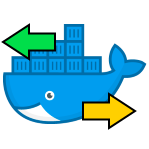

# docker-portmap-server



[](https://hub.docker.com/r/dmotte/portmap-server)

This is a :whale: **Docker image** containing an **OpenSSH server** that can be used for **remote port forwarding** only.

> :package: This image is also on **Docker Hub** as [`dmotte/portmap-server`](https://hub.docker.com/r/dmotte/portmap-server) and runs on **several architectures** (e.g. amd64, arm64, ...). To see the full list of supported platforms, please refer to the `.github/workflows/docker.yml` file.

## Usage

TODO keys generation with:

```bash
mkdir -p vols-portmap-server/etc/ssh
ssh-keygen -A -f vols-portmap-server
mv vols-portmap-server/etc/ssh/* vols-portmap-server
rm -r vols-portmap-server/etc
```

```bash
ssh-keygen -N "" -f vols-portmap-server/ssh_client_key
```

## Development

TODO On-the-fly testing:

```bash
chmod 600 vols-portmap-server/ssh_client_key
ssh -i vols-portmap-server/ssh_client_key -o 'ServerAliveInterval=30' -o 'ExitOnForwardFailure=yes' portmap@localhost -p 2222 -N -R 8080:example.com:80
curl http://localhost/
```
